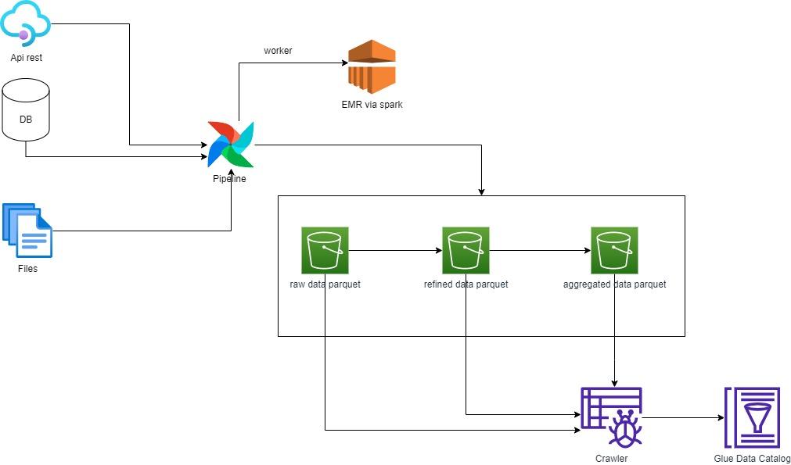

# Diagrama Exercicio 3 

* ## Airflow
O Airflow vai ser responsavel por orquestrar e realizar as tasks do pipeline de dados. Todo o processo de ETL vai ser criado por ele. Será alocado dentro de uma instancia EC2 ou poderá ser alocado em uma instancia da ECS(via docker).

Para executar as suas tarefas, ele possui os workers. Neste caso, para tarefas mais simples e ETL's com pouca complexidade, podemos rodar executar internamente, caso esteja na EC2, ou rodar na ECS, via imagem worker.

Para tarefas com maiores complexidades e com grandes volumes de dados para serem processados, será utilizado o serviço EMR (via spark).

* ## EMR via spark
Este serviço será responsavel por realizar tarefas com maiores complexidades e com grandes volumes. Será controlado pelo Airflow, via boto3 ou via EMR Operator.

Em sua tarefa, irá ler os arquivos do datalake(S3), irá processar e salvar novamente no datalake de acordo com as etapas e repositorios.

* ## Glue Crawler
Este serviço será responsavel por realizar todo o mapeamento do datalake afim de gravar todos os metadados no nosso catalogo de dados.

* ## Glue Data Catalog
Este serviço será responsavel pelo catalogo de dados. Ele irá receber as informações do serviço Glue Crawler e irá salvar e exibir os dados catalogados.